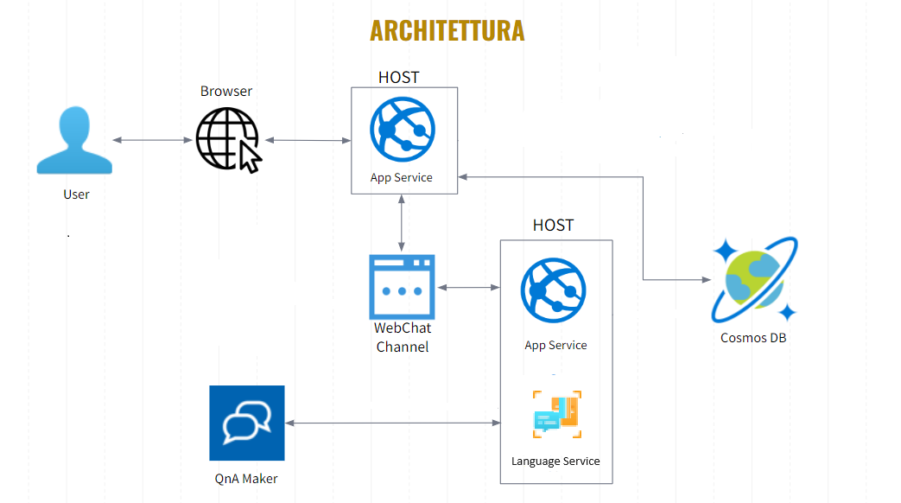

#	Netfli
A project for the class on Cloud Computing at Università degli Studi di Salerno

#	Introduction
Netfli is a cloud-based web application for a Cinema Community that aims to :

 - Explore film pages to discover synopses, trailers, cast information, and user reviews. 
 - Read the opinions of other movie enthusiasts and also have the opportunity to share your own impressions and evaluations through the integrated review feature.

The entire project is made using Microsoft Azure stuffs.
# Project architectures
  
To show the architecture let us put ourselves in the shoes of a user. This arrives on the web app via a browser, the app service is called to obtain the data needed to view the site by retrieving information from the DB.
At any time the user can communicate with a bot, via the WebChat channel to obtain information. The bot is always synchronized with the Web app using a QnA Maker to answer specific questions or curiosities.
 
#	Author
[**DomenicoD'Alessandro**](https://github.com/domenicodale) 
